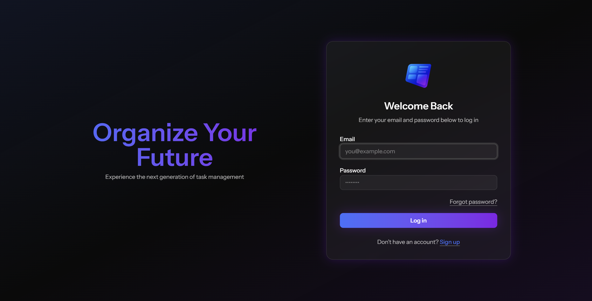
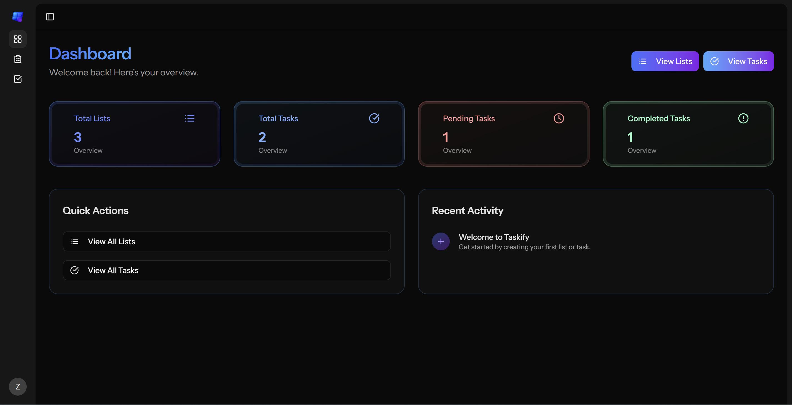
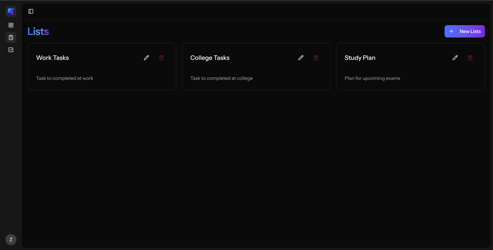
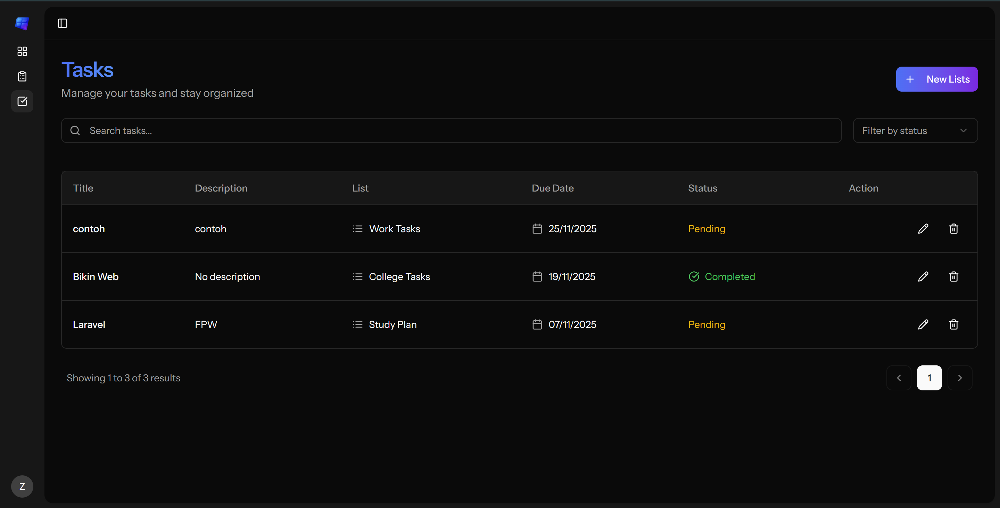
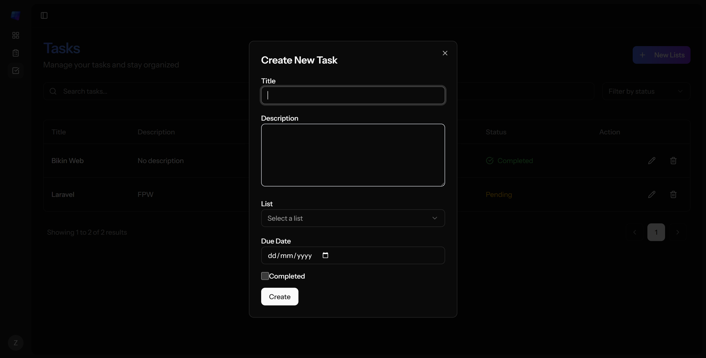

# ✅ Taskify

Taskify is a modern workspace built to help you stay organized and productive. You can create and manage tasks, set priorities, and track progress. Whether you’re a student, freelancer, or professional, Taskify gives you everything to plan, focus, and achieve more effortlessly.

---

## 👥 Team Project

- Adi Pratama Putra
- Erizka Nia Ramadhani
- Zakki Khairul Abdulaziz

---

## 🚀 Features

- ✅ Register / Login
- 🧾 Create, view, update, and delete tasks
- 🌙 Clean, responsive UI (Tailwind CSS)
- ⚡ Fast SPA experience using React + Inertia.js

---

## 📸 Screenshots

Landing Page:


Login Page:


Register Page:


Dashboard:


List:


Create New List:


Task:


Create New Task:



---

## 🔧 Tech Stack

- **Laravel** 12 (API backend)
- **React** 19 + **Inertia.js** (SPA frontend)
- **Tailwind CSS** (styling)
- **MySQL** (database)

---

## 🔨 Installation

```bash
# 1. Clone the repository
git clone https://github.com/zelleienvil/Taskify.git
cd Taskify

# 2. Install backend dependencies
composer install

# 3. Install frontend dependencies
npm install && npm run dev

# 4. Copy .env file and set keys
cp .env.example .env
php artisan key:generate

# 5. Set up database (MySQL)
php artisan migrate

# 6. Start local servers
php artisan serve
